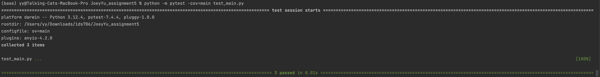

# Joey Yu - IDS Assignment 5

## Project Overview
This project is part of IDS Assignment 5 and demonstrates the usage of SQL database operations, performing CRUD (Create, Read, Update, Delete) tasks using Python. The project also includes continuous integration (CI) using GitHub Actions, test coverage, and a CI/CD pipeline.

## Features
- Connects to a SQL database to manage user data.
- Supports basic CRUD operations:
  - **Create**: Add new users.
  - **Read**: Fetch and display user data.
  - **Update**: Modify user details.
  - **Delete**: Remove users.
- Comprehensive unit tests to ensure the accuracy of database operations.
- CI/CD pipeline implemented to ensure smooth integration.

## CRUD Example

### Users after adding:
(1, 'Tom', 18)
(2, 'Jerry', 20)

### Users after modifying age:
(1, 'Tom', 18)
(2, 'Jerry', 21)

### Users after removing:
(1, 'Tom', 18)

### Testing:
